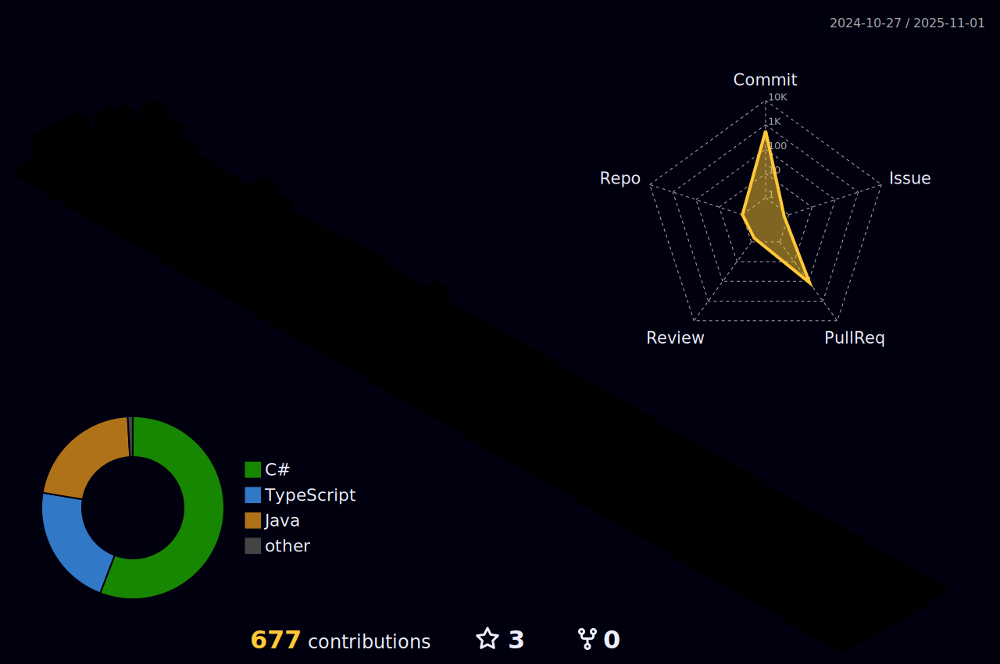

<h1 align="center" style="animation: slideIn 2s;">Hello Visitor👋!</h1>

###

###

<h3 align="left">👩‍💻  About Me</h3>

###

 🔭 Working to be a backend devolper with a little bit of cybersecurity.    📚 Currently studying at UTN (Universidad Tecnologica Nacional).   🀠In my free time I aim to maintain a healthy lifestyle.

###

<h3 align="left">🛠 Language and Tools</h3>

###

  
  
  
  
  
  
  
  
  
  
  
  
  
  
  
  
  

###

<h3 align="left">🔥   My Stats :</h3>

###

<!--
**Fabri-dev/Fabri-dev** is a ✨ _special_ ✨ repository because its `README.md` (this file) appears on your GitHub profile.

Here are some ideas to get you started:

- 🔭 I’m currently working on ...
- 🌱 I’m currently learning ...
- 👯 I’m looking to collaborate on ...
- 🤔 I’m looking for help with ...
- 💬 Ask me about ...
- 📫 How to reach me: ...
- 😄 Pronouns: ...
- ⚡ Fun fact: ...
-->
